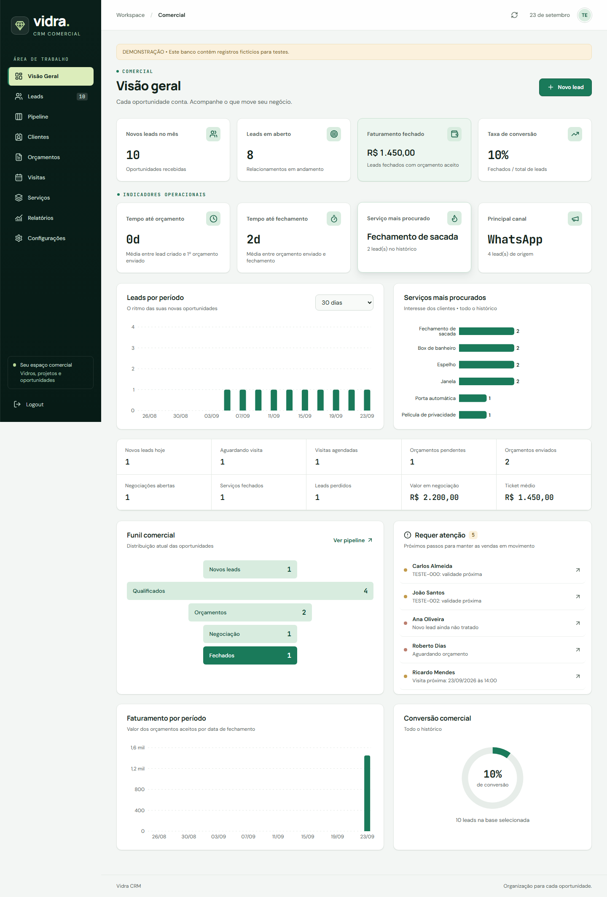
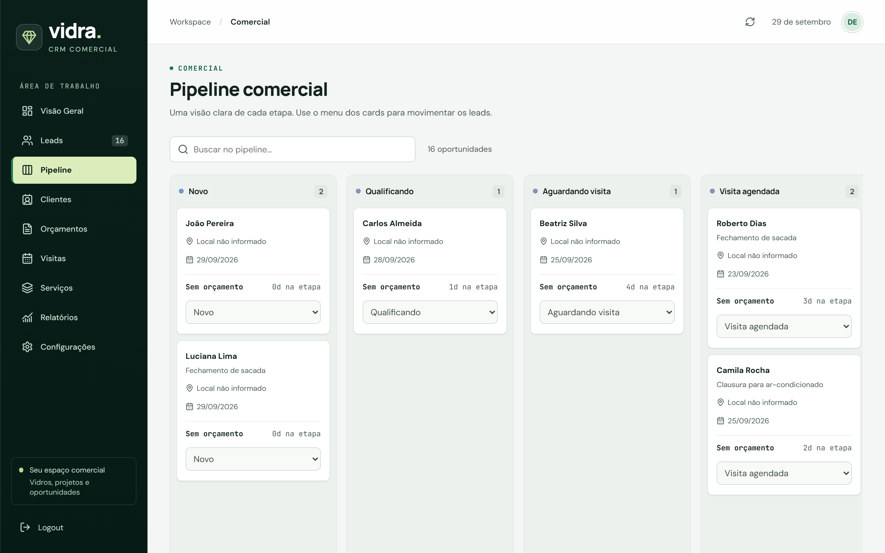
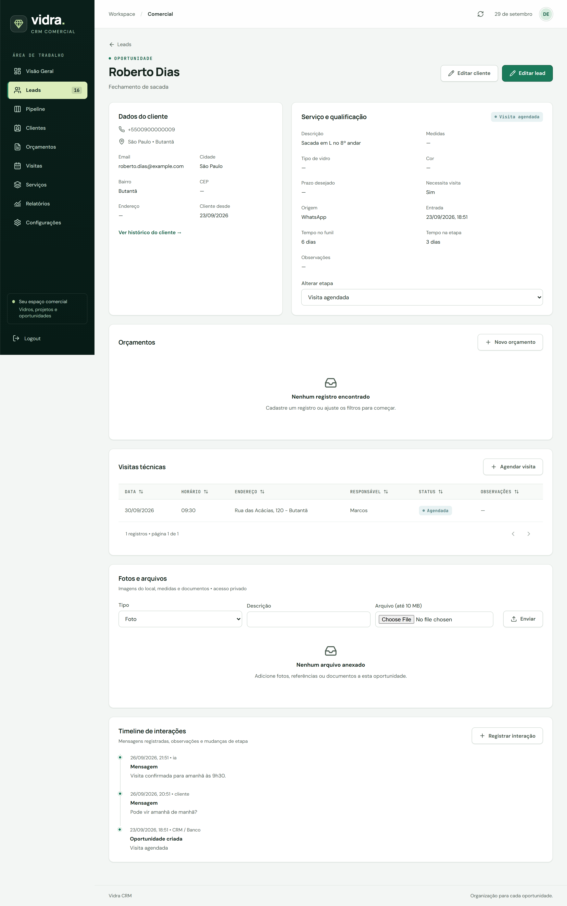
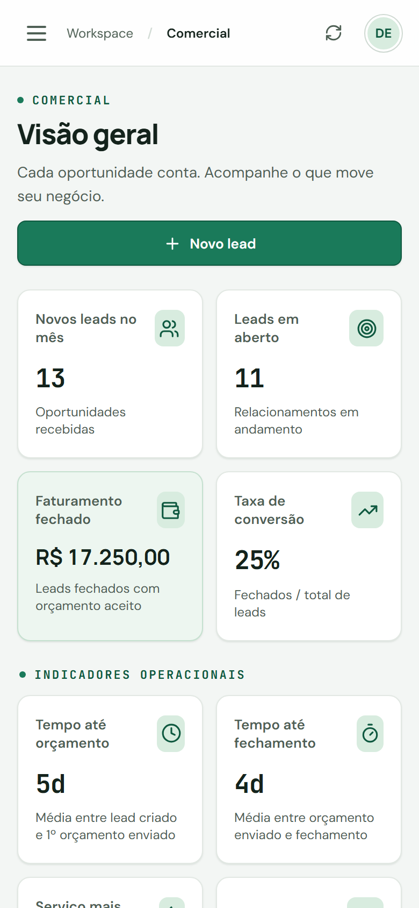
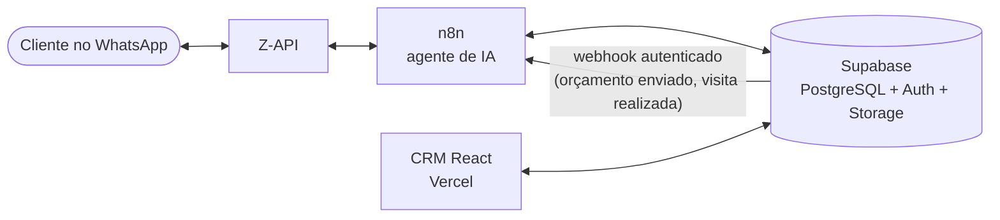

# Vidra CRM

CRM comercial para vidraçarias, conectado a um agente de IA que atende clientes pelo WhatsApp. O agente qualifica o pedido, agenda visitas e envia orçamentos; o CRM mostra tudo em tempo real para a equipe comercial.

**🔗 Acesse:** [vidra-crm.vercel.app](https://vidra-crm.vercel.app)

| Acesso de demonstração | |
| --- | --- |
| Email | `demo@vidracrm.com` |
| Senha | `123456789` |

A conta de demonstração usa uma empresa isolada com dados fictícios: você pode criar, editar e mover registros à vontade. Nenhuma ação dela dispara mensagens reais.

## O agente em ação

Conversa com o agente pelo WhatsApp: ele coleta nome, serviço, local e medidas, agenda a visita técnica e cancela quando o cliente pede. Tudo o que ele registra aparece no CRM.

<!-- VIDEO-DEMO -->

## O CRM



| Pipeline | Detalhe do lead com a conversa da IA | Celular |
| --- | --- | --- |
|  |  |  |

## Arquitetura



- **Atendimento automático:** o agente de IA no n8n conversa com o cliente, registra leads, visitas e orçamentos direto no banco.
- **CRM:** a equipe acompanha o funil, edita registros e envia orçamentos. Mudanças aparecem na hora via Supabase Realtime.
- **Automações de volta:** quando um orçamento é marcado como enviado ou uma visita como realizada, o banco dispara um webhook para o n8n, que envia a mensagem ao cliente pelo WhatsApp.

## Stack

React 19 · Vite · React Router · Supabase (PostgreSQL, Auth, Storage, Realtime, Vault, pg_net) · Recharts · n8n · Z-API · Vercel

## Funcionalidades

- **Visão geral:** 14 indicadores, faturamento e leads por período, funil, conversão e alertas do que precisa de atenção (lead sem resposta, orçamento parado, validade próxima, visita chegando).
- **Pipeline** com dez etapas, do primeiro contato ao fechamento.
- **Leads, clientes, orçamentos, visitas e serviços** com cadastro, edição, busca e filtros.
- **Detalhe do lead** com histórico de conversas (cliente, IA e atendente), propostas, visitas e linha do tempo das etapas.
- **Arquivos privados** (fotos do local, medidas, documentos) com links temporários.
- **Relatórios** por intervalo com rankings de serviços, canais e cidades.
- Layout responsivo, pensado também para uso no celular em campo.

## Segurança

- **Multiempresa com RLS:** toda tabela filtra por `empresa_id = crm_empresa_id()`. A função busca a empresa do usuário no banco (nunca em dados que o próprio usuário controla), então uma conta só enxerga os dados da sua empresa.
- **Sem cadastro público:** contas são criadas pelo administrador. Visitantes anônimos não têm acesso a nenhuma tabela nem função.
- **Webhooks autenticados:** o banco envia uma chave secreta (guardada no Supabase Vault) em cada chamada ao n8n; chamadas sem a chave são recusadas.
- **Storage privado:** bucket fechado, tipos e tamanho de arquivo validados no servidor, acesso por URL assinada de 5 minutos.
- **Frontend:** apenas a chave pública do Supabase no bundle (o cliente recusa chaves secretas), Content-Security-Policy restritiva, HSTS e proteção contra clickjacking configurados no `vercel.json`.

## Decisões e desafios

**Isolar empresas sem confiar no cliente.** O isolamento é feito no banco, não no frontend: toda política RLS compara `empresa_id` com `crm_empresa_id()`, uma função `SECURITY DEFINER` que busca a empresa na tabela `crm_usuarios` pelo `auth.uid()`. Ela nunca lê `user_metadata`, que o próprio usuário pode preencher no cadastro e usar para se colocar em outra empresa.

**Banco e automação conversando nos dois sentidos.** O n8n escreve no banco pela API do Supabase; o caminho de volta usa gatilhos PostgreSQL com `pg_net`, que chamam os webhooks do n8n só quando o status realmente muda (`old.status IS DISTINCT FROM new.status`), evitando loops e mensagens duplicadas. Cada chamada leva uma chave guardada no Supabase Vault, e o n8n recusa as que chegam sem ela.

**Adaptar o CRM a um banco em produção.** O agente do n8n evoluiu o schema (colunas como `enviado_em` e `data_visita`) depois que o CRM foi escrito. Em vez de renomear colunas e quebrar os fluxos em produção, o banco ganhou colunas geradas (`valor_final`, `data_envio`) e o CRM passou a ler os nomes reais. Um diagnóstico SQL comparando o schema em produção com o que o frontend usa encontrou todas as divergências de uma vez.

**Uma demo pública sem risco.** A conta de demonstração tem senha pública, então a proteção está no que ela alcança: uma empresa própria marcada como demonstração, cujos gatilhos não chamam o n8n, com telefones de DDD inexistente. Um script SQL idempotente recria os dados com datas relativas ao dia, para o painel sempre parecer vivo.

**Métricas que batem com o negócio.** Faturamento soma apenas o orçamento aceito de leads fechados, agrupado pela data de fechamento e no fuso de São Paulo. Conversão usa a coorte de leads criada no período. Essas regras têm testes automatizados.

## Executar localmente

Requer Node.js 22.12+ e um projeto Supabase.

```bash
npm install
cp .env.example .env   # preencha VITE_SUPABASE_URL e VITE_SUPABASE_ANON_KEY
npm run dev            # http://localhost:5173
```

Use somente a chave **anon/publishable** no `.env`: variáveis `VITE_*` ficam públicas no bundle.

| Comando | O que faz |
| --- | --- |
| `npm run dev` | Servidor de desenvolvimento |
| `npm run build` | Build de produção em `dist/` |
| `npm test` | Testes das regras de negócio e métricas |
| `npm run test:db` | Valida as migrations em PostgreSQL WASM (PGlite) |
| `npm run test:e2e` | Testes de navegador com Playwright |
| `npm run lint` | ESLint |

## Banco de dados

- `supabase/migrations/`: estrutura inicial, RLS e bucket privado. O banco em produção evoluiu a partir dela (multiempresa, tabelas de atendimento e gatilhos do n8n).
- `supabase/seed/001_servicos.sql`: catálogo de serviços.
- `supabase/seed/003_empresa_demonstracao.sql`: cria ou reseta a empresa de demonstração com dados fictícios e datas relativas ao dia da execução.

Mais detalhes sobre arquivos em [docs/SUPABASE_STORAGE.md](docs/SUPABASE_STORAGE.md).

## Estrutura

```text
src/
├── components/   # formulários, gráficos, arquivos e UI
├── contexts/     # autenticação e dados compartilhados (com Realtime)
├── layouts/      # sidebar, cabeçalho e estrutura responsiva
├── lib/          # cliente Supabase
├── pages/        # telas
├── routes/       # rotas protegidas e lazy loading
├── services/     # consultas, gravação e Storage
└── utils/        # métricas, datas e constantes
supabase/         # migrations e seeds
tests/            # testes unitários e de navegador
```

## Autor

**Gabriel Oliveira** · [LinkedIn](https://www.linkedin.com/in/gabriel-de-oliveiraa) · [GitHub](https://github.com/GabrielOliveira2103)
