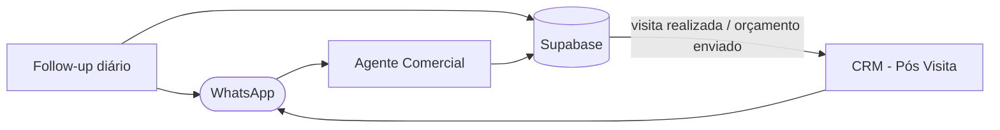

# Workflows do n8n

Automações que atendem os clientes pelo WhatsApp e mantêm o CRM atualizado. Cada workflow tem notas no canvas explicando cada etapa.

| Arquivo | Como começa | O que faz |
| --- | --- | --- |
| [agente-comercial.json](agente-comercial.json) | Mensagem no WhatsApp (webhook da Z-API) | Agente de IA que atende o cliente, cria o lead e agenda, reagenda ou cancela visitas no Google Calendar. Também trata aceite, recusa e desistência de orçamentos e transfere para a equipe quando precisa |
| [crm-pos-visita.json](crm-pos-visita.json) | Gatilho do banco (webhook com chave) | Visita realizada: move o lead para Orçamento pendente. Orçamento enviado: manda o orçamento ao cliente pelo WhatsApp |
| [crm-follow-up-orcamentos.json](crm-follow-up-orcamentos.json) | Todo dia às 9h | Lembra quem recebeu um orçamento há mais de 48 horas e não respondeu. Cada orçamento recebe no máximo um lembrete |

## Como importar

1. No n8n, crie um workflow e use **Import from File** com o arquivo desejado.
2. Crie as credenciais e selecione-as nos nós: **Supabase** (chave de serviço, só no n8n), **OpenAI**, **Google Calendar** e **Header Auth** (a mesma chave que o banco envia no cabeçalho `x-webhook-secret`).
3. Troque os marcadores pelos seus valores:

| Marcador | Onde fica | Substitua por |
| --- | --- | --- |
| `SUA_INSTANCIA` / `SEU_TOKEN` | URL dos nós Z-API | Instância e token da sua conta Z-API |
| `SEU_CLIENT_TOKEN` | Cabeçalho dos nós Z-API | Client-Token da conta Z-API |
| `SEU-CAMINHO-DE-WEBHOOK` | Webhook de entrada do Agente Comercial | Um caminho aleatório; configure a mesma URL na Z-API |
| `ID_DA_EMPRESA` | Nó que cria clientes | ID da empresa na tabela `empresas` |
| `seu-calendario@exemplo.com` | Nós do Google Calendar | Agenda usada para as visitas |
| `55DDDNUMERO` | Aviso ao profissional | WhatsApp de quem recebe os avisos de visita |

Os arquivos publicados aqui não têm tokens, telefones nem e-mails reais: são gerados pelo script [scripts/limpar-workflow.mjs](scripts/limpar-workflow.mjs), que troca esses dados por marcadores e falha se ainda encontrar algo com cara de segredo. As notas e a organização do canvas são geradas por [scripts/gerar-notas.mjs](scripts/gerar-notas.mjs).

## Limitações conhecidas e próximos passos

- **Token da Z-API repetido nos nós de envio.** O próximo passo é centralizá-lo numa credencial do n8n, para trocar em um lugar só.
- **Falha ao apagar evento no Google Calendar.** Se a exclusão falhar por um motivo diferente de "evento já excluído", o cancelamento para sem avisar o cliente. O ideal é avisar a equipe nesse caso.
- **Respostas adicionadas sem teste em produção.** O reagendamento para um horário ocupado e as recusas ou desistências de orçamentos que não podem mudar de status passaram a responder o cliente. A resposta reaproveita nós que já funcionam, mas esses caminhos ainda não foram testados com clientes reais.
